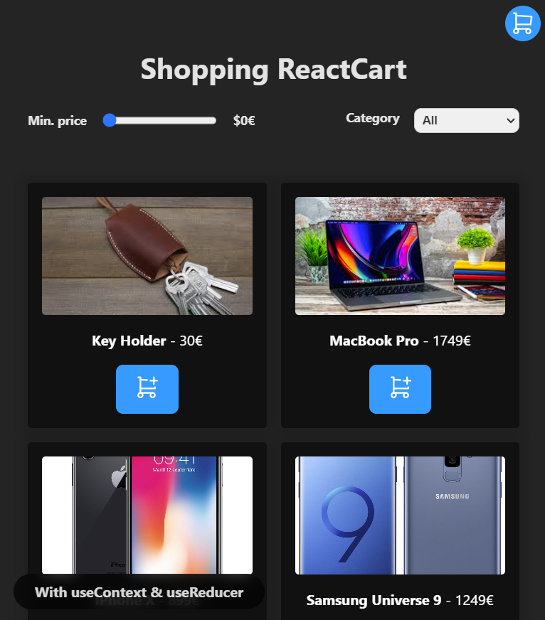

# Shopping ReactCart

## ReactJS

<br>

<div align="center">
  
</div>

<br>

<div>

    Basic shopping cart using useContext and useReducer.

</div>

<br>

**DEPLOY**:
<br>
https://ks-shopping-cart-react.vercel.app

<br>
<br>

# Index

- [Shopping ReactCart](#shopping-reactcart)
  - [ReactJS](#reactjs)
- [Index](#index)
  - [Features](#features)
  - [Technologies and Tools used](#technologies-and-tools-used)
  - [Project Setup](#project-setup)
    - [Compile and Hot-Reload for Development](#compile-and-hot-reload-for-development)
    - [Compile and Minify for Production](#compile-and-minify-for-production)
    - [Lint with ESLint](#lint-with-eslint)
  - [Contribution](#contribution)
  - [Project Status](#project-status)
  - [Project Developer](#project-developer)

<br>

## Features

<div>

    ✔️ Filter by price (0€ - 1000€)

    ✔️ Filter by category (All, Laptops and Smartphones)

    ✔️ Add product to cart

    ✔️ Remove product

    ✔️ Add more quantities to cart

    ✔️ Clear shopping cart.

</div>

<br>

## Technologies and Tools used

<div align="center">
  <br>
    <a href="https://reactjs.org/" target="_blank" rel="noreferrer"> </a>
    <a href="https://developer.mozilla.org/en-US/docs/Web/JavaScript" target="_blank" rel="noreferrer"> </a>
</div>

<br>

## Project Setup

```sh
npm install
```

### Compile and Hot-Reload for Development

```sh
npm run dev
```

### Compile and Minify for Production

```sh
npm run build
```

### Lint with [ESLint](https://eslint.org/)

```sh
npm run lint
```

<br>

## Contribution

If you want to contribute to this project, follow these steps:

1. Perform a fork to the repository.

2. Create a branch for your feature or bugfix: `git checkout -b feature/your-feature-name`

3. Make the necessary changes and commits: `git commit -m 'Add some feature'`

4. Push to branch: `git push origin feature/your-feature-name`

5. Send a pull request to the original repository.

<br>

## Project Status


<br>

## Project Developer

| [<br><sub>Kevin Schans</sub>](https://github.com/KevinVanDerSchans) |
| :--------------------------------------------------------------------------------------------------------------------------------------------: |
